# System Design Interview Scenarios

> End-to-end walkthroughs for Senior and Lead loops — requirements to operability.

---

## How to Use This Handbook

In Senior and Lead system design loops, panels are not grading a single “correct” diagram. They evaluate whether you can:

1. **Clarify constraints** before drawing boxes — users, geography, consistency, latency, compliance.
2. **Drive a coherent architecture** from requirements, not from buzzwords.
3. **Quantify** with back-of-envelope estimates and explain what those numbers change.
4. **Own tradeoffs** — consistency vs availability, push vs pull, SQL vs NoSQL, sync vs async.
5. **Operate the system** — failure modes, security boundaries, SLOs, and incremental improvements.

**Interview rhythm (recommended):** 2–3 min requirements → 8–10 min high-level design → 10–15 min deep dive (data, APIs, scaling) → 5–8 min tradeoffs / bottlenecks / security / ops → 2 min improvements.

**Enterprise framing:** Prefer Spring Boot services behind an API gateway, PostgreSQL/MySQL for transactional cores, Redis for hot caches/sessions, Kafka/Pulsar for durable event streams, object storage for blobs, and Kubernetes (or ECS) for deployment. Call out idempotency, outbox patterns, and auditability — banking, telco, and GovTech panels expect this.

**Notation:** Each scenario below is a complete walkthrough. Adapt numbers to the interviewer’s constraints; treat estimates as working assumptions you state aloud and revise.

---

## Table of Scenarios

| # | Scenario | Primary Hard Problems |
|---|----------|----------------------|
| 1 | Uber | Matching, geo indexing, surge, driver location |
| 2 | Grab | Multi-vertical marketplace, shared mobility + payments |
| 3 | Food Delivery | Restaurant capacity, ETA, courier batching |
| 4 | Netflix | CDN, encoding pipeline, personalization |
| 5 | YouTube | Upload → process → serve, comments, recommendations |
| 6 | WhatsApp | Chat fan-out, presence, media, end-to-end encryption |
| 7 | Banking Transfer | Strong consistency, ledger, idempotency, compliance |
| 8 | Hotel Booking | Inventory locks, overbooking policy, search |
| 9 | Travel Platform | Flights + hotels + packages, orchestration |
| 10 | Notification Service | Multi-channel fan-out, templates, preferences |
| 11 | URL Shortener | Write/read skew, redirect latency, analytics |
| 12 | File Storage | Chunking, dedupe, ACL, resumable upload |
| 13 | Search Engine | Crawl, index, ranking, freshness |
| 14 | Inventory System | Reservation, oversell prevention, multi-warehouse |
| 15 | Payment Gateway | PCI scope, retries, reconciliation, webhooks |

---

## 1. Design Uber

### Requirement Gathering

**Functional**

- Riders request a trip: pickup, dropoff, vehicle type, payment method.
- Drivers go online, receive offers, accept/reject, navigate, complete trips.
- Matching pairs a rider request with a nearby eligible driver within seconds.
- Pricing includes base fare, distance/time, surge multipliers, tolls, tips.
- Real-time location updates for ETA, map tracking, and safety features.
- Trip history, receipts, ratings, support tickets.

**Non-functional**

- Matching P99 latency under ~3–5 seconds for offer generation.
- Location update ingest: tens of thousands of drivers updating every 1–5 seconds in a metro.
- High availability for matching and trip lifecycle; brief degradation of map polish is acceptable.
- Consistency: trip state must be strongly consistent; location can be eventually consistent.
- Multi-city, multi-timezone; regulatory requirements for trip data retention.

**Clarify early**

- Geography: one city MVP vs multi-region from day one?
- Driver offer exclusivity: one offer at a time vs broadcast?
- Surge: algorithmic vs rule-based?
- Offline maps / poor connectivity behavior?

**Back-of-envelope (illustrative metro)**

- 50k concurrent online drivers; location every 4s → ~12.5k updates/sec.
- 100 peak trips/sec requested; 10% of DAU booking in peak hour.
- Payload ~200 bytes → location ingest ~2.5 MB/s raw (manageable); fan-out to riders is the harder part.

### High Level Design

Core domains: **Identity**, **Trip**, **Matching**, **Pricing**, **Location**, **Payments**, **Notifications**, **Maps/ETA**.

Flow:

1. Rider creates trip request → Trip Service persists `REQUESTED`.
2. Matching Service queries geospatial index for candidate drivers, scores them (ETA, rating, idle time, vehicle type), creates exclusive offer.
3. Driver app receives push/WebSocket offer; accept → Trip becomes `ASSIGNED` → `IN_PROGRESS` → `COMPLETED`.
4. Pricing Service computes fare; Payment Service captures authorization/charge.
5. Location Service streams driver/rider positions to interested clients via pub/sub.

Prefer event-driven trip state transitions (`TripAssigned`, `TripStarted`, `TripCompleted`) for downstream billing, analytics, and support.

### Component Diagram

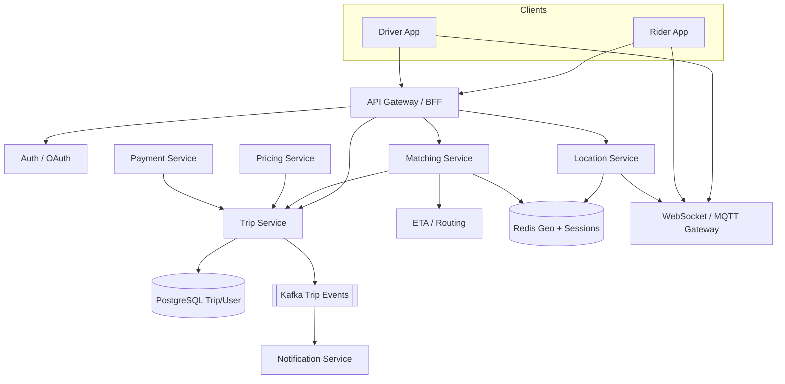

**ASCII alternative**

```
Rider/Driver Apps → API Gateway → Trip | Matching | Location | Pricing | Payments
                                      ↓
                         PostgreSQL + Redis GEO + Kafka + WS Gateway
```

### Database Design

**PostgreSQL (transactional)**

- `users`, `drivers`, `vehicles`, `payment_methods`
- `trips`: `id`, `rider_id`, `driver_id`, `status`, `pickup`, `dropoff`, `vehicle_type`, `requested_at`, `started_at`, `completed_at`, `fare_cents`, `currency`, `city_id`
- `trip_offers`: `trip_id`, `driver_id`, `status`, `expires_at` (unique active offer constraints)
- `trip_events` / outbox for reliable publishing
- `ratings`, `receipts`

Indexes: `(city_id, status, requested_at)`, `(driver_id, status)`, GIST or app-level geo for pickup points if querying history.

**Redis**

- `GEOADD drivers:{city}` for online driver positions.
- Driver session: vehicle type, status (`IDLE`/`OFFERED`/`BUSY`), last heartbeat.
- Short-TTL offer locks: `offer:{tripId}` → `driverId`.

**Cold/analytics**

- Location breadcrumbs in time-series or object storage (not OLTP). Partition by day/city.

### API Design

```http
POST /v1/trips
{ "pickup": {...}, "dropoff": {...}, "vehicleType": "XL", "paymentMethodId": "..." }
→ 201 { "tripId", "status": "REQUESTED", "estimatedFare" }

POST /v1/trips/{tripId}/cancel
POST /v1/drivers/me/status  { "status": "ONLINE", "location": {...} }
POST /v1/trips/{tripId}/offers/{offerId}/accept
POST /v1/trips/{tripId}/offers/{offerId}/reject
GET  /v1/trips/{tripId}
GET  /v1/trips/{tripId}/tracking   # or WebSocket channel trip:{id}
```

**WebSocket events:** `offer.created`, `trip.status_changed`, `location.updated`, `fare.finalized`.

Idempotency keys on trip create and payment capture. Optimistic versioning or status-machine guards on trip transitions.

### Scaling Strategy

- **Shard by city/region** for matching and location — most queries are local.
- Location write path: UDP/WebSocket ingest → Location Service → Redis GEO; batch writes to cold store.
- Matching workers pull from city-partitioned Kafka topics or poll request queues.
- Horizontal scale Trip Service (stateless Spring Boot); sticky sessions only at WS gateway if needed.
- Read replicas for trip history; CQRS projection for “my recent trips.”
- CDN for static map tiles; ETA service caches road-graph segments.

**Capacity levers:** increase GEO cell granularity, reduce location frequency when idle, offer radius expansion with backoff.

### Tradeoffs

| Choice | Benefit | Cost |
|--------|---------|------|
| Exclusive single-driver offer | Fair, less chaos | Higher match latency if reject |
| Broadcast to N drivers | Faster accept | Race conditions, bad UX |
| Redis GEO | Fast nearby query | Memory; eventual consistency |
| Strong trip FSM in Postgres | Auditable truth | Hot rows under retries |
| Push location to rider | Smooth map | Fan-out cost |

### Bottlenecks

- Hot city Redis GEO under peak concerts/stadiums.
- Matching thundering herd when many drivers reject.
- WebSocket gateway connection count (millions city-wide across regions).
- Payment authorization latency blocking trip start if designed synchronously.
- ETA API rate limits from map providers.

### Security

- Separate rider/driver auth scopes; device attestation for driver apps where required.
- PII minimization in logs; trip location access only for participants + authorized support with audit.
- Rate-limit trip creates per rider; fraud signals on payment + device + cancel patterns.
- TLS everywhere; signed deep links for receipts.
- Least privilege IAM for services accessing payment tokenization vault.

### Monitoring

- SLIs: match success rate, time-to-first-offer, offer accept rate, trip completion rate, location freshness age.
- Alerts: matching queue depth, Redis memory, WS disconnect spikes, payment failure %, surge anomaly.
- Tracing: `tripId` as correlation ID across Trip → Match → Pay.
- Business: cancel reasons, wait time distribution, driver utilization.

### Improvements

- Batching / shared rides; multi-hop matching optimization.
- ML ranking for offers; predictive positioning of drivers.
- Offline-tolerant driver app with local queue for location.
- Regional active-active with city affinity and conflict-free trip IDs.
- Safety stack: share-trip, emergency SOS, audio recording consent flows.

---

## 2. Design Grab

### Requirement Gathering

Grab is a **super-app**: ride-hailing, food, deliveries, payments/wallet, possibly bookings. Interviewers often want you to design the **platform**, not only rides.

**Functional**

- Multiple verticals sharing identity, wallet, map, notifications, support.
- Merchant/driver/courier onboarding; order and trip lifecycles per vertical.
- GrabPay: top-up, P2P, merchant QR, ride/food checkout.
- Cross-vertical promotions and loyalty.

**Non-functional**

- Isolation so food peak does not kill ride matching.
- Shared platform SLOs with per-vertical error budgets.
- Regulatory: e-money license constraints, KYC/AML for wallet.
- Multi-country: currency, tax, data residency.

**Clarify**

- Scope: full super-app vs rides + payments only?
- Single app binary with modular BFFs?
- Wallet as source of truth for all checkouts?

**Back-of-envelope**

- 20M MAU; peak 5k RPS across verticals API gateway.
- Wallet: strong consistency, lower RPS but higher criticality (four 9s).
- Food order events: 1k/sec peak city-wide; ride location still dominates write volume.

### High Level Design

**Platform layer:** Identity, Accounts, Wallet/Ledger, Maps, Notifications, Risk, Experimentation, CMS for promos.

**Vertical layer:** Ride, Food, Express Delivery, Bookings — each with own services and databases (DB-per-service), integrating via platform APIs and events.

Checkout always goes through **Payment Orchestrator** → Wallet or card rails. Verticals emit domain events; platform analytics and CRM consume via Kafka.

### Component Diagram

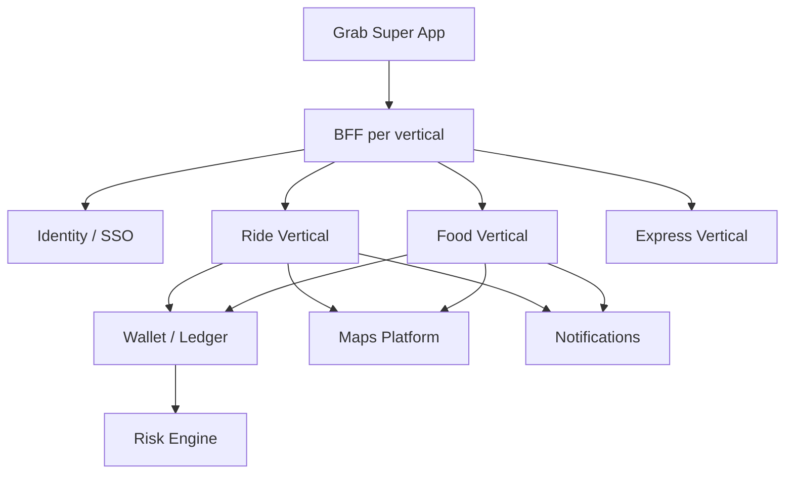

### Database Design

- **Identity DB:** users, devices, KYC status, consents.
- **Wallet ledger DB:** accounts, journal entries (double-entry), holds, idempotency keys — never overwrite balances; append ledger.
- **Ride DB / Food DB:** separate schemas; no cross-vertical joins.
- **Promo DB:** coupons, redemption counters (Redis for hot counters + DB for audit).
- **Outbox tables** in each vertical for reliable integration events.

Partition wallet journals by `account_id` hash; retain immutability for regulators.

### API Design

```http
POST /v1/wallet/holds
{ "amount", "currency", "merchantRef", "idempotencyKey" }

POST /v1/wallet/holds/{holdId}/capture
POST /v1/wallet/holds/{holdId}/release

POST /v1/rides/trips   # vertical
POST /v1/food/orders
GET  /v1/me/activity   # platform aggregation via BFF
```

Platform APIs versioned independently from vertical APIs. Internal service-to-service mTLS.

### Scaling Strategy

- Cell-based architecture per country/region.
- Vertical autoscaling independent; shared gateway with per-route concurrency limits.
- Wallet scaled by account shard; synchronous path kept minimal (authorize/capture).
- Heavy personalization and search for food catalogs on read replicas / OpenSearch.
- Shared Kafka clusters with quotas per vertical producer.

### Tradeoffs

| Choice | Benefit | Cost |
|--------|---------|------|
| Super-app monolith BFF | Fast UX iteration | Blast radius |
| Strict vertical isolation | Independent deploy | Duplication |
| Central wallet | Unified money UX | Critical bottleneck |
| Shared driver/courier pool | Efficiency | Complex allocation fairness |

### Bottlenecks

- Wallet ledger contention on celebrity merchants or payroll days.
- Cross-vertical promo engine becoming a distributed monolith.
- Map/ETA provider dependency shared by all verticals.
- Customer support tooling needing aggregated views across DBs.

### Security

- KYC tiers gating wallet limits; step-up auth for high-value transfers.
- PCI / e-money controls; tokenize cards; never store PAN in vertical DBs.
- Fraud graph: device, velocity, graph of senders/receivers.
- Data residency: PH/SG/MY data stays in-region.
- Partner merchant API keys, signed webhooks, IP allowlists.

### Monitoring

- Platform SLOs + vertical SLOs; error budget burn alerts.
- Wallet: reconciliation lag, hold aging, negative balance attempts (should be zero).
- Cross-vertical: checkout conversion, payment method mix.
- Dependency health: map provider, SMS OTP, card acquirer.

### Improvements

- Unified courier allocation marketplace across food/express.
- Real-time risk scoring with feature store.
- Modular monolith per vertical early, extract only hot paths.
- Open banking / QR interoperability (e. and similar rails).
- Greener routing and carbon estimates as product differentiator.

---

## 3. Design Food Delivery

### Requirement Gathering

**Functional**

- Customer browses restaurants, menus, places order, tracks delivery.
- Restaurant accepts/rejects, prepares food, marks ready.
- Couriers assigned, pick up, deliver; proof of delivery.
- Ratings, refunds, promo codes, tips.

**Non-functional**

- Menu freshness minutes-level; order state seconds-level.
- Peak lunch/dinner spikes (2–5×).
- Marketplace fairness: courier earnings, restaurant SLAs.
- ETA accuracy drives trust more than raw throughput.

**Clarify**

- Self-delivery vs platform couriers vs hybrid?
- Multi-restaurant carts?
- Scheduled orders?

**Back-of-envelope**

- 10k restaurants in a city; 100k menu items.
- Peak 500 orders/min → ~8 orders/sec average, bursts higher.
- Tracking updates every 5s per active delivery (5k concurrent) → 1k location msgs/sec.

### High Level Design

Services: **Catalog**, **Cart/Checkout**, **Order**, **Restaurant**, **Dispatch/Courier Matching**, **Pricing/Fees**, **Payment**, **Tracking**, **Reviews**.

Order FSM: `CREATED` → `PAID` → `RESTAURANT_ACCEPTED` → `PREPARING` → `READY` → `PICKED_UP` → `DELIVERED` / `CANCELLED` / `REFUNDED`.

Dispatch can start after restaurant accept or predictively earlier. Use geospatial matching similar to Uber but with restaurant dwell time and batching (one courier, multiple pickups) as optimization.

### Component Diagram

```
Customer App ─┐
Restaurant POS├→ API Gateway → Order Service → Payment
Courier App ──┘       │              ↓
                      ├→ Catalog (OpenSearch + CDN images)
                      ├→ Dispatch Service → Redis GEO couriers
                      └→ Tracking WS Gateway
Events: Kafka topics order.events, dispatch.events → Notif, Analytics
```

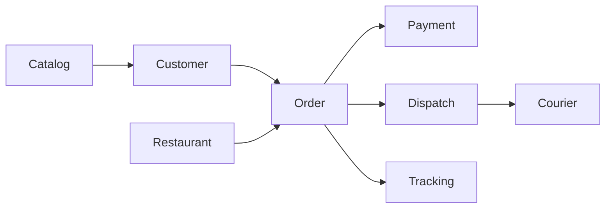

### Database Design

- `restaurants`, `menus`, `menu_items`, `modifiers` (versioned; publish snapshot for customers).
- `orders`, `order_items`, `order_status_history`.
- `courier_assignments`, `delivery_proofs`.
- Catalog search: OpenSearch index `restaurant_id`, cuisine, geo, rating, ETA proxy.
- Redis: courier GEO, restaurant busy scores, order ETA cache.

Soft-delete menu items; orders reference immutable line-item snapshots (name, price at purchase).

### API Design

```http
GET  /v1/restaurants?lat=&lng=&cuisine=
GET  /v1/restaurants/{id}/menu
POST /v1/carts/{cartId}/checkout
POST /v1/orders/{id}/restaurant/accept
POST /v1/orders/{id}/restaurant/ready
POST /v1/dispatch/assignments/{id}/accept
POST /v1/orders/{id}/delivered  { "proof": "..." }
```

Webhook to restaurant POS partners. Idempotent checkout with `Idempotency-Key`.

### Scaling Strategy

- Cache restaurant list tiles by geohash; invalidate on open/close.
- Order service partitioned by city_id.
- Async payment confirmation via webhook if 3DS; hold courier until paid.
- Read-heavy catalog on CDN + edge caching for images.
- Pre-position couriers using demand heatmaps before peak.

### Tradeoffs

| Choice | Benefit | Cost |
|--------|---------|------|
| Assign courier early | Lower delivery time | Cancel waste |
| Assign after ready | Less courier wait | Longer ETA |
| Monolithic order+dispatch | Simpler txn | Scaling coupling |
| Menu in DB + search index | Flexible query | Sync lag |

### Bottlenecks

- Restaurant tablet offline → order stuck; need timeout + customer messaging.
- Dispatch under rain surge (demand spike + courier shortage).
- Menu image CDN origin load during campaigns.
- Refund workflows involving payment + courier pay + restaurant settlement.

### Security

- Restaurant staff roles; prevent customer from forging “delivered.”
- PII: drop-off instructions sensitive; mask in courier UI after delivery window.
- Promo abuse: device/account velocity limits.
- Partner POS HMAC signatures.

### Monitoring

- Order conversion funnel; accept latency by restaurant; food-ready accuracy vs promise.
- Courier utilization, batch rate, O2C (order-to-customer) minutes.
- Payment auth rate; cancel rate after accept (waste metric).
- ETA error: predicted vs actual absolute minutes.

### Improvements

- Smart batching and zone pacing.
- Dynamic prep-time ML from restaurant historical variance.
- Dark kitchens / virtual brands as catalog entities.
- Sustainability: reusable packaging incentives.
- Store-and-forward restaurant app for flaky networks.

---

## 4. Design Netflix

### Requirement Gathering

**Functional**

- Browse catalog, personalized homepage, search, play video, continue watching.
- Multiple profiles per account; parental controls.
- Admin/content pipeline: ingest mezzanine, encode ladders, package DRM, publish metadata.

**Non-functional**

- Playback start < ~2s on good networks; minimal rebuffer ratio.
- Global scale; regional catalogs and licensing windows.
- Read-heavy (1000:1); writes are viewing events and continue-watching.
- Cost efficiency of egress dominates architecture.

**Clarify**

- Streaming only vs download offline?
- Live events in scope?
- Device types (Smart TV, mobile, web)?

**Back-of-envelope**

- 200M subscribers; 20% concurrent peak → 40M concurrent viewers.
- Average bitrate 5 Mbps → 200 Tbps egress (CDN problem, not origin).
- Viewing events: 40M × 1 event/min → ~700k events/sec (aggregate aggressively).

### High Level Design

Split **Control plane** (catalog, identity, personalization, playback auth) from **Data plane** (CDN edge serving segments).

Playback flow:

1. Client requests playback license/manifest from Playback Service.
2. Service authorizes entitlement, returns CDN-signed URLs / tokenized manifest (DASH/HLS).
3. Client fetches segments from Open Connect / commercial CDN; origin shielded.
4. Telemetry beaconed to analytics for QoE and continue-watching.

Encoding pipeline: upload → validate → encode ladder (4K→240p) → package → DRM keys → quality checks → publish to origin + CDN purge/preposition.

### Component Diagram

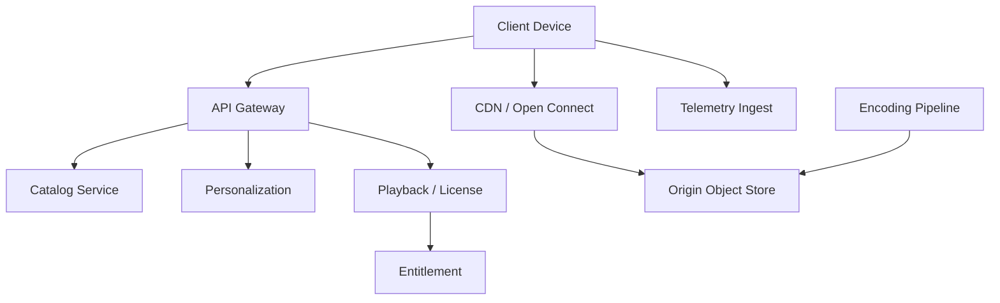

### Database Design

- Catalog metadata: titles, seasons, assets, localized text — Cassandra/Dynamo-style or Postgres + cache for smaller scale interviews; at Netflix scale, distributed KV + search.
- Continue watching: `profile_id` → list of `{titleId, positionMs, updatedAt}` in Redis + durable store.
- Entitlements: subscription plan, region rights windows.
- Viewing history: append-only event log in Kafka → cold store (S3) → warehouse.
- A/B experiment assignments.

### API Design

```http
GET /v1/homepage?profileId=
GET /v1/titles/{id}
GET /v1/search?q=
POST /v1/playback/{titleId}/session
→ { "manifestUrl", "licenseUrl", "cdnTokens", "watchId" }

POST /v1/telemetry/qoe
POST /v1/continue-watching
```

License server for Widevine/FairPlay; separate from metadata API.

### Scaling Strategy

- Push almost all bytes to CDN; origin hit rate tiny.
- Personalization precomputed offline + nearline; online ranker only reorders.
- Stateless Spring (or equivalent) control-plane services behind gateway; heavy cache (EVCache/Redis).
- Telemetry via agents → Kafka → stream processors; never synchronous to playback path.
- Multi-region active-active for control plane; sticky play session tokens with short TTL.

### Tradeoffs

| Choice | Benefit | Cost |
|--------|---------|------|
| Precompute rows | Fast homepage | Stale personalization |
| Client-side ABR | Adapts to network | Complex clients |
| Own CDN appliances | Egress savings | Capex/ops |
| Strong DRM | Studio deals | Device certification pain |

### Bottlenecks

- Manifest/license services during global premiere.
- Metadata cache stampedes on title launch.
- Encoding farm backlog for new seasons.
- Telemetry pipeline cost and cardinality explosion.

### Security

- Entitlement checks before license issuance; geo-fencing.
- DRM content keys in HSM/KMS; short-lived license tokens.
- Account sharing detection (product + risk).
- Signed CDN URLs; prevent hotlinking.
- Privacy: viewing history sensitive; profile isolation.

### Monitoring

- QoE: startup time, rebuffer ratio, bitrate ladder distribution, error codes by CDN/ASN.
- Control plane latency and cache hit ratio.
- Encoding SLA: time from mezzanine land to playable.
- Title availability by region vs license window.

### Improvements

- Download-to-go with offline licenses.
- Live/linear streaming with DVR windows.
- Bandwitdth-aware art image packaging.
- On-device personalization for privacy.
- Green encoding (codec efficiency AV1/VVC) to cut egress.

---

## 5. Design YouTube

### Requirement Gathering

**Functional**

- Upload video, process, publish; watch with adaptive streaming.
- Comments, likes, subscriptions, notifications, channels.
- Search and recommendations; Creator Studio analytics.
- Monetization: ads, memberships (optional deep dive).

**Non-functional**

- Uploads are large and bursty; processing is async and expensive.
- Watch path globally distributed; comments need fan-out and moderation.
- Eventual consistency OK for view counts; stronger for publish visibility rules.

**Clarify**

- Live streaming in scope?
- Shorts/vertical format?
- Moderation SLA?

**Back-of-envelope**

- 500 hours uploaded per minute (classic stat) → massive transcoding fleet.
- 1B daily watches; thumbnails and manifests dominate small-object QPS.
- Comments: hot videos can receive thousands/sec — shard by `video_id`.

### High Level Design

Pipelines:

1. **Upload:** resumable chunked upload to blob store; create `video_id` in processing state.
2. **Processing:** virus scan → transcode ladders → thumbnail extraction → content ID fingerprint → moderation signals → publish.
3. **Serve:** similar to Netflix CDN data plane; additional UGC discovery.
4. **Social:** comments service, subscription fan-out (push notifications + activity inbox).
5. **Recommend:** candidate generation + ranking; watch history features.

### Component Diagram

```
Uploader → Upload Service → Object Storage
                ↓
         Processing Orchestrator → Transcoders → Origin
                ↓
         Metadata Service → Search Index
Viewer → CDN segments + Watch API → Recommend / Comments / Ads
```

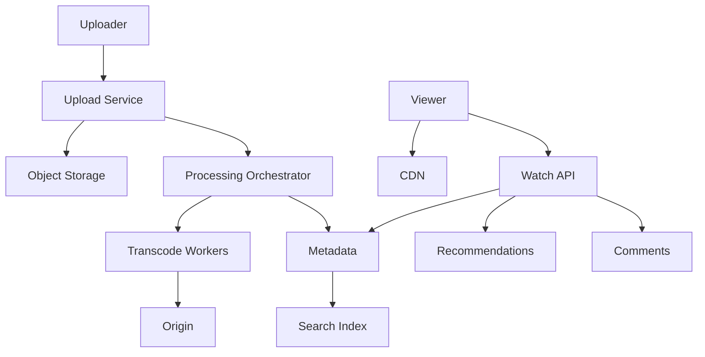

### Database Design

- `videos`: id, channel_id, status, visibility, duration, processing_progress, default_audio_lang.
- `video_assets`: rendition, codec, bitrate, storage_key.
- `channels`, `subscriptions`.
- `comments`: shard/partition by `video_id`; nested via `parent_id`; moderation_state.
- `counters`: likes/views in Redis with periodic DB reconcile (or specialized counter service).
- Watch history and recommend features in analytical stores.

### API Design

```http
POST /v1/videos/uploads       → { uploadUrl, videoId }
PUT  /v1/videos/uploads/{id}/chunks/{n}
POST /v1/videos/{id}/publish
GET  /v1/watch/{id}           → metadata + playback
POST /v1/videos/{id}/comments
POST /v1/videos/{id}/like     # idempotent per user
GET  /v1/feed/subscriptions
GET  /v1/recommend
```

Signed upload URLs; processing webhooks internal.

### Scaling Strategy

- Transcode queue priority: partner/creators SLA tiers.
- CDN for video + thumbnails; image CDN with size variants.
- Comments: cache top-level threads; collapse replies; rate-limit per user/video.
- View count: approximate with HyperLogLog/batch increments; display delayed.
- Recommendations: offline training; online features from feature store; heavy caching of home feed per user for minutes.

### Tradeoffs

| Choice | Benefit | Cost |
|--------|---------|------|
| Many renditions | QoE | Storage/compute |
| Sync comment read | Fresh | Hot partitions |
| Push sub inbox | Fast feed | Write amplification |
| Pull sub feed | Simple writes | Slow read fan-in |

### Bottlenecks

- Viral video comment shard.
- Transcoding backlog after live events.
- Thumbnail origin storms.
- Recommendation feature freshness vs cost.
- Copyright Content ID matching latency.

### Security

- Upload authz; quota per channel; malware scanning.
- Privacy settings: private/unlisted/public; signed URLs for private.
- Abuse: spam comments, scraped mass uploads, bot views.
- Child safety / COPPA constraints; age-gated content.
- Creator account takeover protections (2FA).

### Monitoring

- Processing success rate and time-to-ready percentiles.
- Playback QoE (same family as Netflix).
- Comment post latency and moderation queue age.
- Recommend CTR/watch time (online eval + guardrails).
- Storage growth and CDN cache hit ratio.

### Improvements

- Edge transcoding for Shorts; preview while uploading.
- Creator multi-audio/multi-language tracks.
- Real-time collaboration on premieres.
- Better spam classifiers; trusted flagger pipelines.
- Tiered storage for cold rarely watched UGC.

---

## 6. Design WhatsApp

### Requirement Gathering

**Functional**

- 1:1 and group messaging; delivery/read receipts; presence (online/last seen).
- Media messages (image, video, voice, docs); voice/video calls (optional deep dive).
- Multi-device support; message sync.
- End-to-end encryption (E2EE) expectations.

**Non-functional**

- Extremely chatty connections; millions of concurrent persistent connections per region.
- Low latency message relay; store-and-forward for offline devices.
- Ordering per chat; at-least-once delivery with client dedupe.
- Privacy-first metadata minimization.

**Clarify**

- E2EE mandatory?
- Group size limits?
- Business/WhatsApp API accounts?

**Back-of-envelope**

- 1B users; 20% online → 200M concurrent connections (connection gateway problem).
- Avg 20 messages/user/day → ~230k msgs/sec average; peaks multi-million/sec globally.
- Media: store encrypted blobs in object storage; relay only pointers.

### High Level Design

- **Connection layer:** sticky WebSocket/TCP gateways; user routed to gateway shard.
- **Chat service:** validates, persists server-side encrypted envelopes (or plaintext if non-E2EE interview variant), routes to recipients.
- **Presence service:** ephemeral in Redis; last-seen write throttled.
- **Media service:** upload encrypted attachment → CDN/object store → share media id.
- **Group service:** membership; fan-out strategies.
- **Push notifications:** APNs/FCM when offline.

E2EE (Signal protocol style): server cannot read content; still handles routing, storage of ciphertext, and push metadata carefully.

### Component Diagram

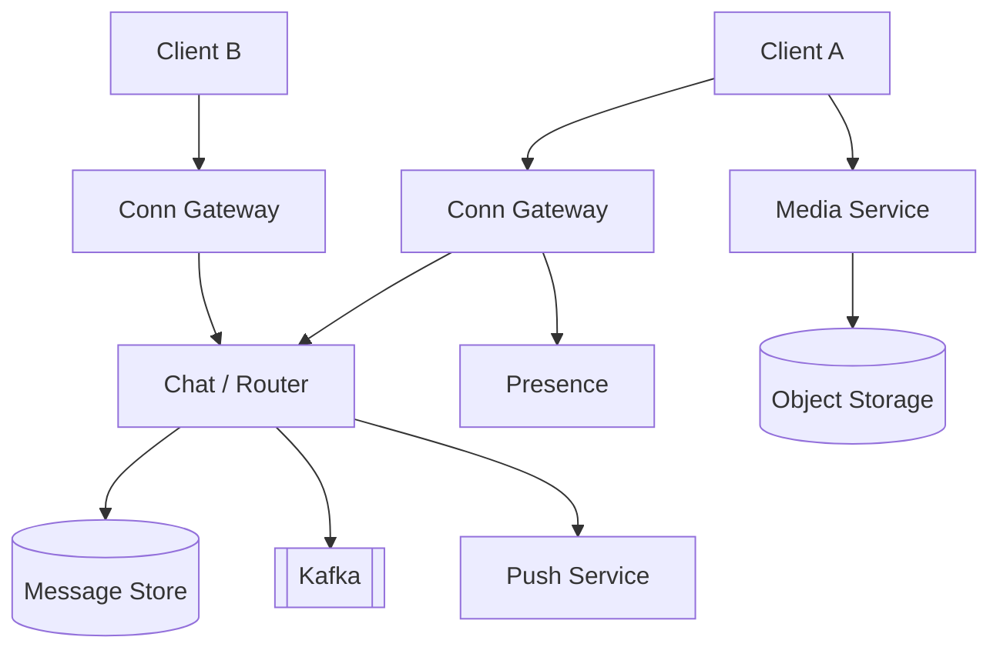

### Database Design

- Messages: partition by `chat_id` (1:1 canonical id or group id); columns: `msg_id`, `sender`, `ciphertext`, `sent_at`, `server_received_at`.
- User mailbox / offline queue: per `user_id` for devices not connected.
- Groups: members table; large groups may use fan-out-on-write vs fan-out-on-read hybrid.
- Device sessions: identity keys, signed prekeys (E2EE).
- Cassandra/Scylla often cited for write-heavy message storage; Postgres possible for smaller scale.

TTL / storage limits for media; user delete and “delete for everyone” as tombstones with constraints.

### API Design

Mostly realtime protocol (binary protobuf) over persistent connection:

- `auth`, `send_message`, `ack_delivery`, `ack_read`, `presence_subscribe`
- HTTP for media upload and account recovery

```http
POST /v1/media   → { mediaId, putUrl }
POST /v1/sessions/register-device
```

Idempotent `client_msg_id` for retries.

### Scaling Strategy

- Gateway fleet with consistent hashing on `user_id`; rebalance carefully.
- Regional deployment; cross-region relay for multi-country chats.
- Group fan-out: for small groups write to each mailbox; for large groups write once + members pull or use multicast channels.
- Media via CDN; never through chat hot path.
- Presence updates coalesced; don’t persist every online flicker.

### Tradeoffs

| Choice | Benefit | Cost |
|--------|---------|------|
| E2EE | Privacy, trust | Server-side search/features limited |
| Fan-out-on-write | Fast reads | Large group cost |
| Persistent conn | Low latency | Ops complexity |
| Store ciphertext forever | Sync multi-device | Storage + privacy risk |

### Bottlenecks

- Gateway connection storms after regional outages.
- Hot groups (broadcast-like).
- Push provider rate limits.
- Multi-device sync conflicts and key distribution.
- Media upload on poor mobile networks.

### Security

- E2EE + safety number / QR verification.
- Abuse reporting with optional message franking / sealed sender tradeoffs.
- Account takeover: SIM swap defenses, 2FA.
- Spam/voip abuse rate limits; business messaging opt-in.
- Minimize metadata retained (who talked to whom) under policy/legal constraints.

### Monitoring

- Message send-to-ack latency; offline queue age.
- Gateway CPU/conn count; TLS handshake errors.
- Delivery success; push vs online delivery ratio.
- Group fan-out latency percentiles.
- Media failure rates.

### Improvements

- Better multi-device (companion linked devices).
- Channels/broadcast lists at scale.
- Encrypted backups (user-controlled keys).
- Rich reactions and disappearing messages with correct crypto semantics.
- Business quality ratings and template messaging controls.

---

## 7. Design Banking Transfer

### Requirement Gathering

**Functional**

- Transfer funds between accounts (intra-bank) and to external banks (ACH/wire/FPS/PayNow-style).
- Balance inquiry, transaction history, scheduled transfers, recurring.
- Limits, approvals for high value, beneficiary management.
- Notifications and statements.

**Non-functional**

- **Strong consistency** and correctness over availability for money movement.
- Idempotency mandatory; exactly-once *business effect* despite at-least-once infra.
- Full audit trail; regulatory reporting; retention years.
- Low RPS relative to social apps, but extreme criticality (error budget near zero for ledger bugs).

**Clarify**

- Real-time rail vs batch clearing?
- Multi-currency?
- Corporate dual-control approvals?

**Back-of-envelope**

- 5M retail accounts; peak 200 transfers/sec during salary credit windows.
- History reads dominate; writes must serialize per account.
- Ledger entries grow forever → partitioning and archival strategy required.

### High Level Design

Classic **ledger-centric** design:

1. API validates customer, MFA, limits, beneficiary.
2. Create transfer intent with idempotency key.
3. Ledger service posts double-entry journal in one DB transaction (debit + credit) **or** holds + async settle for external rails.
4. Outbox publishes `TransferCompleted`; notification and analytics consume.
5. External transfers: state machine `PENDING_CLEARING` → `SETTLED` / `REJECTED` with reconciliation.

Never “update balance” alone; balance is sum of ledger or maintained with transactional guard.

### Component Diagram

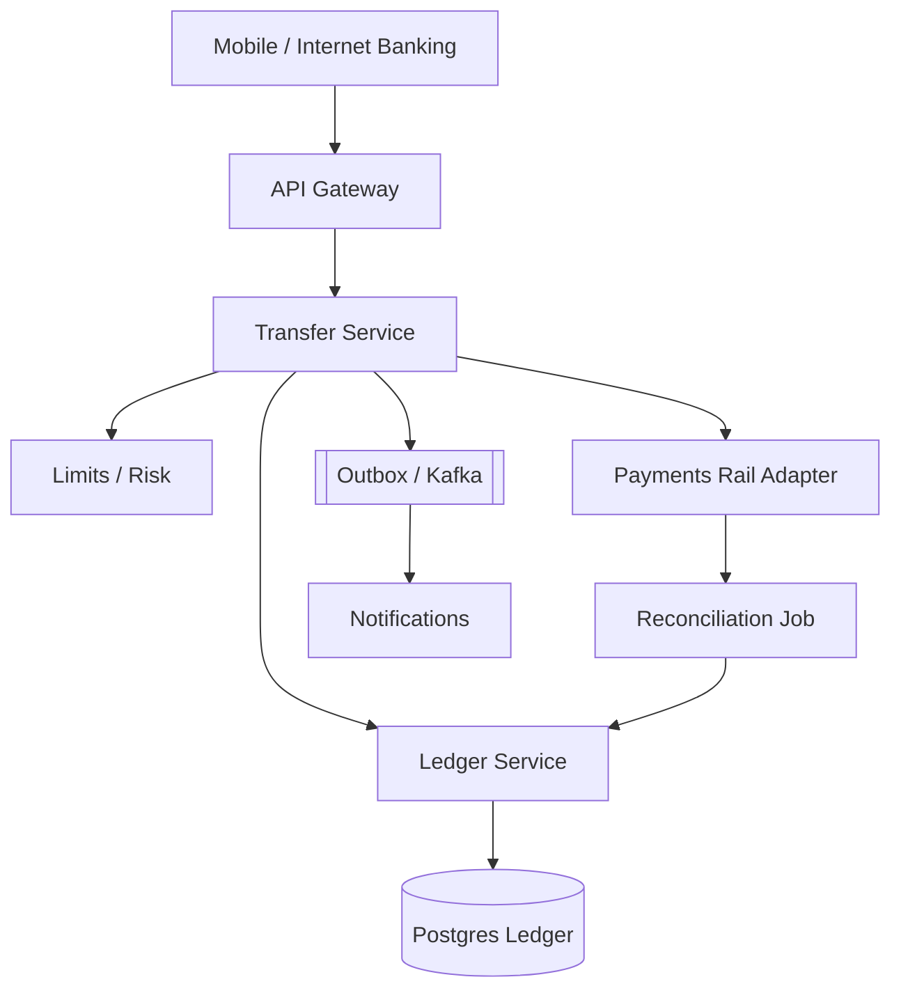

### Database Design

```text
accounts(id, customer_id, currency, status, version)
journal_entries(id, transfer_id, account_id, amount, direction, posting_time, value_date)
transfers(id, idempotency_key UNIQUE, from_account, to_account, amount, status, rail, created_at)
holds(id, account_id, amount, status, expires_at)
beneficiaries(...), limits(...), audit_log(...)
```

Constraints: check constraints on amounts > 0; unique idempotency; transfer status FSM enforced in service + optimistic locking on `accounts.version` if denormalized balance used.

Row-level locking / `SELECT … FOR UPDATE` on accounts in deterministic order (`min(id), max(id)`) to avoid deadlock.

### API Design

```http
POST /v1/transfers
Idempotency-Key: 6f2c...
{
  "fromAccountId": "...",
  "toAccountId": "...",
  "amount": "100.00",
  "currency": "SGD",
  "narrative": "Rent"
}
→ 202/201 { "transferId", "status": "COMPLETED|PENDING" }

GET /v1/accounts/{id}/balances
GET /v1/accounts/{id}/transactions?cursor=
POST /v1/transfers/{id}/cancel   # only if rail allows
```

Step-up: `X-MFA-Token` for high risk.

### Scaling Strategy

- Shard ledgers by account range or customer segment; **no cross-shard transfer without a settlement account / two-phase pattern**.
- Prefer single-partition transfers for intra-bank when both accounts co-located; else use bank internal suspense accounts.
- CQRS: transaction history from read models; ledger is source of truth.
- Peak salary runs: batch posting windows with controlled concurrency.
- Hot accounts (treasury) get dedicated infrastructure.

### Tradeoffs

| Choice | Benefit | Cost |
|--------|---------|------|
| Synchronous ledger post | Immediate finality | Lower availability under failover |
| Async external settle | Decouples rails | Complex reconciliation |
| Denormalized balance | Fast reads | Must stay transactional with journal |
| Microservices split | Team scale | Distributed txn risk |

### Bottlenecks

- Hot account lock contention.
- Reconciliation breaks on ambiguous rail responses.
- Statement generation month-end.
- Idempotency store growth and retention.
- Dual-writes without outbox causing missing notifications (not missing money if ledger-first).

### Security

- Strong customer authentication; device binding; fraud velocity checks.
- Maker-checker for corporate.
- Encryption at rest; HSM for signing rail messages.
- Segregation of duties in ops; immutable audit.
- PCI if cards involved; otherwise still strict PII and financial data controls.
- Pen-test transfer of authorization (IDOR) — always authorize account ownership.

### Monitoring

- Zero tolerance alerts: unbalanced journal detection, negative balance, duplicate idempotency conflicts spike.
- Transfer success by rail; pending aging; reconciliation unmatched count.
- p99 latency of posting; lock wait time.
- Fraud declines and false positive rate.

### Improvements

- ISO 20022 richer remittance data.
- Real-time gross settlement adapters.
- Snapshot + incremental balance materialization with proof.
- Chaos testing of partial rail failures.
- Open banking APIs with fine-scoped consents.

---

## 8. Design Hotel Booking

### Requirement Gathering

**Functional**

- Search hotels by location/date/guests/filters; view rooms and rates.
- Book with payment; modify/cancel per policy; confirmations.
- Partner inventory from hotel chains/OTAs (if meta); or owned inventory.
- Reviews, photos, loyalty rates.

**Non-functional**

- Search read-heavy; booking write path must prevent double booking.
- Rate/availability changes frequently (cache invalidation hard).
- Seasonal traffic spikes; flash sales.

**Clarify**

- Inventory owner: platform vs hotel CRS via channel manager?
- Soft hold timers on rooms?
- Overbooking policy allowed?

**Back-of-envelope**

- 100k hotels; search QPS 5k peak; booking QPS 50 peak.
- Availability matrix: hotels × rooms × dates — combinatorial; use compressed inventory representations.

### High Level Design

- **Search service:** geo + inverted filters on denormalized hotel documents (OpenSearch).
- **Availability service:** room-night inventory counts or allotments.
- **Booking service:** transactional reserve → pay → confirm.
- **Rate service:** pricing rules, taxes, cancellation policies.
- **Channel manager adapters** for external CRS.

Reservation flow: quote → hold (TTL 5–15 min) → payment capture → confirm → notify hotel.

### Component Diagram

```
User → Search (OpenSearch) → Hotel Page
     → Booking Service → Availability (row lock / Redis hold)
                       → Payment
                       → Confirmation + Kafka → Hotel Notify / Email
```

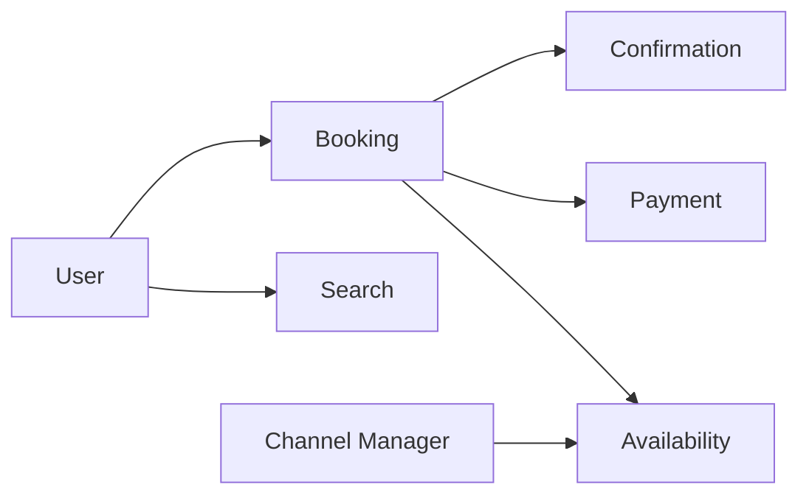

### Database Design

- `hotels`, `room_types`, `rate_plans`, `cancellation_policies`.
- `inventory`: `(room_type_id, date, available_count, version)` — critical hot table.
- `holds`: `(id, room_type_id, dates, expires_at, session_id)`.
- `bookings`, `booking_rooms`, `payments`, `guests`.
- Search index documents with geo point, amenities, min price cache (eventually consistent).

Use date-range reservation tables carefully; many systems store per night rows for simpler locking.

### API Design

```http
GET  /v1/search?lat=&lng=&checkIn=&checkOut=&guests=
GET  /v1/hotels/{id}/availability?checkIn=&checkOut=
POST /v1/holds
POST /v1/bookings  { "holdId", "paymentMethod", "guestDetails" }
POST /v1/bookings/{id}/cancel
```

Idempotency on booking create. Hold must be validated at booking time.

### Scaling Strategy

- Cache search results by normalized query key with short TTL.
- Shard inventory by hotel_id; bookings route to owning shard.
- Read replicas for hotel content; primary for inventory mutations.
- Precompute calendar availability for popular hotels.
- Async sync from channel managers with conflict resolution rules.

### Tradeoffs

| Choice | Benefit | Cost |
|--------|---------|------|
| Hard inventory lock | No double book | Lower conversion if holds linger |
| Overbooking | Higher occupancy | Customer pain / comps |
| Per-night rows | Simple locks | Storage + many rows |
| Range locks | Compact | Complex overlap queries |

### Bottlenecks

- Hot hotel inventory row (NYE in Vegas).
- Search index lag showing ghost availability (“last room” false positives).
- Payment timeout after hold expiry races.
- Partner API latency for on-demand rates.

### Security

- PCI via payment provider; tokenize cards.
- Prevent scraping of rates (bot management).
- Authorize booking access by account; secure confirmation tokens.
- Partner authentication for channel managers.
- Fraudulent bookings / card testing patterns.

### Monitoring

- Search-to-book conversion; hold abandonment; book failure reasons.
- Double-booking incidents (should be zero) — page immediately.
- Inventory sync lag from partners.
- Cancellation rate and refund SLA.

### Improvements

- Price prediction and demand-based recommendations.
- Flexible dates search.
- GraphQL BFF for mobile chatty pages.
- Room attribute personalization.
- Stronger consistency via transactional outbox to search invalidation.

---

## 9. Design Travel Platform

### Requirement Gathering

**Functional**

- Search/book **flights**, **hotels**, **cars**, and **packages** (bundled).
- User itineraries, e-tickets, boarding passes, trip timeline.
- Multi-provider aggregation (GDS like Amadeus/Sabre, airline NDC, hotel suppliers).
- Post-booking: changes, cancellations, disruptions, ancillary upsells.

**Non-functional**

- Orchestration across unreliable third parties.
- Quote freshness short-lived; booking must revalidate price.
- Partial failure in packages (flight OK, hotel fail) needs compensating transactions.
- Internationalization, FX, tax rules.

**Clarify**

- Agency vs merchant of record?
- Packages: own inventory vs dynamic package on the fly?
- Corporate travel policy engine?

**Back-of-envelope**

- Search fan-out to 5–20 suppliers per query; cache aggressively.
- Booking QPS low dozens; search QPS thousands.
- Supplier SLAs 2–10s — dominate latency budget.

### High Level Design

**Aggregation layer** + **Booking orchestrator** (saga):

1. Search service queries suppliers in parallel with timeouts/hedging.
2. Normalize results to canonical offers; rank; cache.
3. User selects offer → create `trip` draft with priced offers + TTL.
4. Booking saga: reserve flight → reserve hotel → pay → issue tickets → confirm; compensate on failure.
5. Itinerary service becomes system of record for the traveler.

### Component Diagram

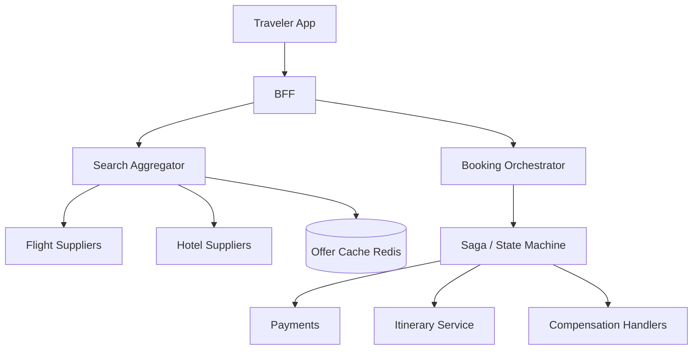

### Database Design

- `trips`, `trip_segments` (type: FLIGHT/HOTEL/CAR), `offer_snapshots` (immutable JSON of priced offer).
- `booking_attempts`, `saga_state`, `compensation_log`.
- `tickets`, `vouchers`, `travelers`, `documents`.
- Supplier raw payloads stored for dispute (object storage + pointer).
- Search cache not authoritative.

### API Design

```http
GET  /v1/flights/search?...
GET  /v1/hotels/search?...
POST /v1/packages/search
POST /v1/trips/drafts     { "selectedOfferIds": [...] }
POST /v1/trips/{id}/book  { "payment", "travelers" }
GET  /v1/trips/{id}
POST /v1/trips/{id}/cancel
```

Reprice endpoint before pay: `POST /v1/trips/{id}/revalidate`.

### Scaling Strategy

- Parallel supplier calls with bulkheads and circuit breakers (Resilience4j in Spring).
- Multi-level cache: airport pair popular routes warm cache.
- Asynchronous ticket issuance where supplier allows; user sees “processing.”
- Separate read itinerary service globally replicated.
- Queue booking sagas; control concurrency per supplier to respect rate limits.

### Tradeoffs

| Choice | Benefit | Cost |
|--------|---------|------|
| Dynamic packaging | Flexibility | Saga complexity |
| Pre-negotiated packages | Simpler book | Less selection |
| Soft hold across suppliers | UX | Fragile |
| Merchant of record | Margin control | Chargeback/liability |

### Bottlenecks

- Slowest supplier in fan-out (tail latency).
- Saga stuck states needing ops tooling.
- Schedule change (flight irregular ops) cascading itinerary updates.
- FX conversion and tax calculation edge cases.
- Seat/ancillary inventory races.

### Security

- PII (passports) encrypted; vault with short retention where possible.
- Supplier credential management; rotate secrets.
- Fraud on high-value flight bookings; 3DS.
- Secure e-ticket links; prevent itinerary IDOR.
- Compliance with airline settlement and PCI.

### Monitoring

- Supplier availability and latency SLIs; cache hit ratio.
- Saga success rate; compensation rate; time-to-ticket.
- Price change rate at revalidation (conversion killer).
- Customer disruption tickets correlated with airline IRROPS feeds.

### Improvements

- NDC-first airline connectivity.
- Proactive rebooking on cancellations.
- Carbon filters and greener options ranking.
- Corporate policy + expense integration.
- Graph-based multi-city trip optimizer.

---

## 10. Design Notification Service

### Requirement Gathering

**Functional**

- Send notifications across **push, email, SMS, in-app, WhatsApp Business**.
- Template management with localization and variables.
- User preferences and quiet hours; mandatory vs optional categories.
- Scheduling, batch campaigns, transactional messages.
- Delivery receipts and engagement events (open/click).

**Non-functional**

- Extremely high fan-out (marketing) vs low-latency transactional (OTP).
- Provider diversity and failover.
- Exactly-once *desired* for OTP; at-least-once with dedupe keys.
- Compliance: CAN-SPAM, GDPR consent, telecom opt-out.

**Clarify**

- Only transactional or also marketing blast?
- Priority lanes?
- Guaranteed ordering per user?

**Back-of-envelope**

- 10M users; campaign to 20% → 2M sends; at 50k/sec providers → ~40s pipeline time.
- OTP: 500/sec peak; p99 < 2s end-to-end.

### High Level Design

Producer apps publish `NotificationRequest` → **Notification API** validates + enriches → **Router** applies preferences → enqueue to channel-specific topics → **Workers** call providers → persist status → webhook callbacks update delivery state.

Separate **priority queues** for OTP/security vs marketing. Template renderer (Mustache/Handlebars or server-side) with strict escaping.

### Component Diagram

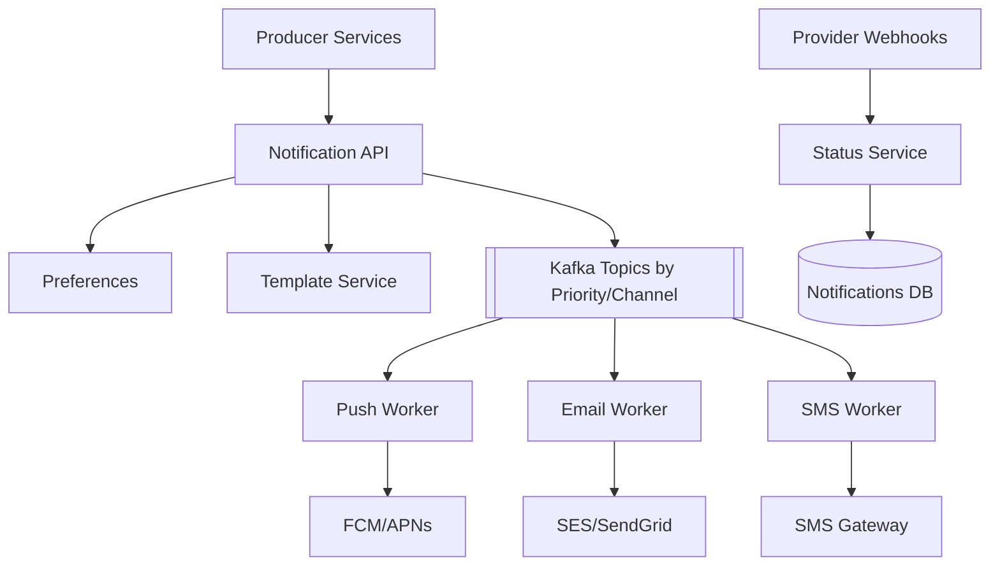

### Database Design

- `templates(id, channel, locale, body, version)`
- `user_preferences(user_id, category, channel, enabled)`
- `devices(user_id, push_token, platform)`
- `notifications(id, user_id, template_id, channel, status, idempotency_key, created_at)`
- `delivery_attempts(...)`
- Suppression lists / global unsubscribes

Cassandra or partitioned Postgres by `user_id` or time for high volume status logs.

### API Design

```http
POST /v1/notifications
Idempotency-Key: ...
{
  "userId": "...",
  "templateKey": "ORDER_SHIPPED",
  "channelHint": "PUSH",
  "data": { "orderId": "..." },
  "priority": "HIGH"
}

POST /v1/notifications/bulk
GET  /v1/notifications/{id}
PUT  /v1/users/{id}/preferences
```

Internal admin: template publish with approval workflow.

### Scaling Strategy

- Partition Kafka by `userId` for per-user ordering when required.
- Autoscale workers on lag; isolate OTP consumer group.
- Provider rate-limit tokens (leaky bucket) per tenant.
- Shard status DB; archive old notifications to S3.
- Edge template caching; pre-render for huge campaigns carefully (PII!).

### Tradeoffs

| Choice | Benefit | Cost |
|--------|---------|------|
| Sync send API | Simple for producers | Head-of-line blocking |
| Async always | Resilience | Eventual delivery |
| Single provider | Simpler | Outage risk |
| Multi-provider failover | HA | Cost + complexity |
| Marketing + txn shared | Efficiency | Noisy neighbor |

### Bottlenecks

- Provider API quotas.
- Hot partition for celebrity user devices (rare) or bad keying.
- Template render CPU for huge personalized campaigns.
- Preference lookup at fan-out time.
- Webhook storms from providers.

### Security

- Authn for producers (mTLS + scopes per template category).
- OTP templates locked down; prevent data exfil via template injection.
- PII redaction in logs; encrypt email payloads at rest if stored.
- Consent proof storage; honor STOP for SMS immediately.
- Prevent open relays; tenant isolation in multi-tenant gateway.

### Monitoring

- Enqueue-to-send latency by priority; provider error rates; bounce/complaint rates.
- Kafka lag by topic; DLQ depth.
- OTP success ratio and latency (business-critical dashboard).
- Preference opt-out rates after campaigns (quality signal).

### Improvements

- Intelligent channel fallback (push → SMS) with cost policies.
- Frequency capping and fatigue scoring.
- Inbox aggregation for in-app notifications.
- Deliverability warming for email domains.
- Outbox integration library for Spring producers.

---

## 11. Design URL Shortener

### Requirement Gathering

**Functional**

- Create short links from long URLs; redirect on hit.
- Optional custom aliases, expiry, password, one-time links.
- Click analytics (count, referrer, geo, device).
- API for partners; UI for humans.

**Non-functional**

- Redirect path ultra-hot: p99 < 10–50ms in-region.
- Writes much fewer than reads (e.g., 1:100–1:1000).
- High availability on read; create can be slightly weaker.
- Predictable short codes; avoid enumeration of private links.

**Clarify**

- Public service vs internal only?
- Custom domains?
- Analytics realtime vs batch?

**Back-of-envelope**

- 100M new URLs/month ≈ 40 writes/sec average.
- 10k redirects/sec peak.
- 7-char base62 → 62^7 ≈ 3.5e12 keys (plenty).

### High Level Design

- **Write path:** validate URL → allocate unique key → store mapping → return short URL.
- **Read path:** cache (Redis/CDN) → DB → 301/302 redirect.
- **Analytics:** async event on each redirect to Kafka → aggregations.

Key generation: pre-generated key ranges per instance, Snowflake IDs encoded base62, or hash+collision retry. Avoid coordinated DB autoincrement as sole global bottleneck.

### Component Diagram

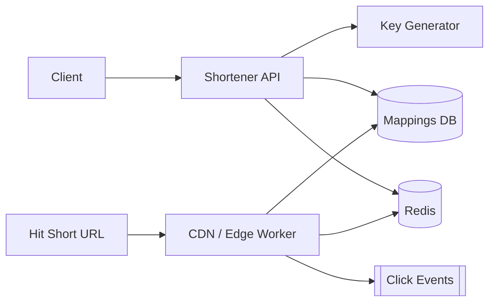

### Database Design

```text
urls(
  key PK,
  long_url,
  owner_id,
  created_at,
  expires_at,
  is_custom,
  status
)
clicks_daily(key, date, count)  -- rollups
```

Unique constraint on custom aliases. Soft-delete / disable for abuse.

### API Design

```http
POST /v1/links
{ "url": "https://...", "customAlias": "launch", "ttlDays": 30 }
→ { "code": "aZ9fQ1", "shortUrl": "https://sho.rt/aZ9fQ1" }

GET  /v1/links/{code}
GET  /v1/links/{code}/stats
DELETE /v1/links/{code}
```

Redirect: `GET /{code}` → `302 Location: long_url` (302 if analytics need recount; 301 if immutable forever — discuss tradeoff).

### Scaling Strategy

- Cache popular codes at edge; negative cache for misses carefully (poisoning).
- Shard DB by key hash; or use DynamoDB single-table `code` PK.
- Separate analytics cluster; never block redirect on analytics write.
- Rate-limit creates per API key; captcha on public UI.
- Global: region-local caches; replicate mappings asynchronously with create-in-home-region sticky.

### Tradeoffs

| Choice | Benefit | Cost |
|--------|---------|------|
| 301 | CDN cache friendly | Weaker click counts |
| 302 | Accurate analytics | More origin hits |
| Hash of URL | Deterministic | Enumeration / collision / can’t differ aliases |
| Random key | Unpredictable | Needs uniqueness check |
| SQL | Simple | Hot range if poor keys |

### Bottlenecks

- Viral link cache miss stampede.
- Analytics volume > redirect volume handling.
- Custom alias contention.
- Global replication lag showing 404 briefly.

### Security

- SSRF protection when validating URLs (block link-local/metadata IPs).
- Malware/phishing URL scanning; report flows.
- Auth for custom domains and enterprise.
- Rate limits; random codes with enough entropy.
- HTTPS-only redirects option; HSTS on short domain.

### Monitoring

- Redirect p99; cache hit ratio; 404 rate.
- Create success/conflict rates.
- Kafka analytics lag.
- Abuse blocks and phishing takedowns.

### Improvements

- Edge workers for redirect without origin.
- A/B destinations / experiments.
- Branded domains multi-tenant.
- QR code generation.
- Bloom filters for existence checks at scale.

---

## 12. Design File Storage

### Requirement Gathering

**Functional**

- Upload/download files; resumable uploads; multipart for large objects.
- Folders, sharing links, ACLs (user/group), versioning.
- Deduplication optional; virus scan; preview generation.
- Client SDKs (mobile/web/desktop sync — clarify scope).

**Non-functional**

- Multi-GB files; throughput and integrity (checksums).
- Durability 11 nines class via erasure coding/replication.
- Metadata strong consistency; blob durable store.
- Cost: storage + egress.

**Clarify**

- Dropbox-like sync or object-store-like S3 API?
- Max file size?
- Cross-region replication?

**Back-of-envelope**

- 100M users × 10 GB avg = 1 EB raw before dedupe/compression — architecture must assume object storage foundation.
- Metadata ops 10k QPS; data plane terabits via CDN/direct.

### High Level Design

Split **metadata control plane** from **blob data plane**:

1. Client requests upload session → Metadata Service creates file record `UPLOADING`.
2. Client uploads chunks directly to object storage via signed URLs (or via chunk servers).
3. Complete: verify checksums → assemble/commit → virus scan async → `READY`.
4. Download: authorize → signed URL from nearest region/CDN.

Block-level dedupe (content-addressed chunks) optional advanced topic.

### Component Diagram

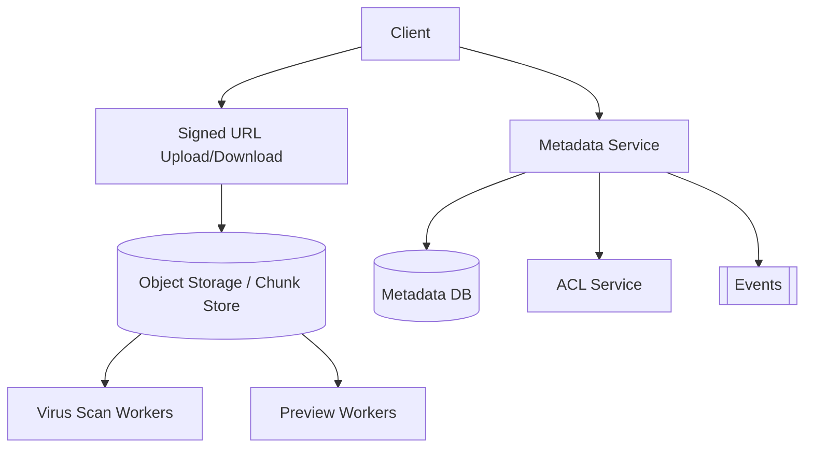

### Database Design

- `files(id, parent_folder_id, name, owner_id, size, content_hash, status, version)`
- `file_versions(...)`
- `blocks` / `chunks(hash PK, size, refcount)` if dedupe
- `file_blocks(file_version_id, offset, chunk_hash)`
- `shares(file_id, grantee, permission, expires_at)`
- `upload_sessions(id, file_id, expires_at)`

Directories as rows with `type=FOLDER`. Unique `(parent_id, name)` where not deleted.

### API Design

```http
POST /v1/files/upload-sessions  { "name", "parentId", "size", "checksum" }
→ { "sessionId", "parts":[ { "partNumber", "putUrl" } ] }

POST /v1/files/upload-sessions/{id}/complete
GET  /v1/files/{id}/download-url
POST /v1/files/{id}/shares
GET  /v1/folders/{id}/children
```

S3-compatible API is a valid interview framing for enterprise.

### Scaling Strategy

- Direct-to-blob uploads to avoid app-tier bandwidth bottleneck.
- Metadata sharded by `owner_id` or `file_id`.
- CDN for popular public shares; range requests for media.
- Erasure coding cold tier; replicate hot tier.
- Async workers for scan/preview/transcode; quarantine bucket.

### Tradeoffs

| Choice | Benefit | Cost |
|--------|---------|------|
| Signed URL direct | Scales | Harder to inspect inline |
| Proxy upload | Easier policy | Expensive bandwidth |
| Chunk dedupe | Storage savings | Complexity + privacy crosstalk risk |
| Strong listing consistency | UX | Harder geo distribution |

### Bottlenecks

- Metadata DB for large directory listings.
- Small-file overhead (use packing/compaction).
- Virus scan backlog gating availability.
- Cross-region download latency without replication.
- Thumbnail storms.

### Security

- Fine-grained ACL + share links with passwords/expiry.
- Encryption at rest (SSE-KMS) and TLS in transit; optional client-side encryption.
- Antivirus + type allowlists for enterprise tenants.
- Prevent link enumeration; signed cookies.
- Audit every share and download for sensitive tenants.
- Malicious zip bombs / decompression limits.

### Monitoring

- Upload success/complete rates; part failure retries.
- Download latency; 403 auth failures.
- Durability checks / scrubber errors.
- Storage growth; orphan blob GC age.
- Scan positive rate and quarantine queue.

### Improvements

- Delta sync / block-level sync for desktop clients.
- Legal hold and retention locks (WORM).
- Smart tiering.
- Collaborative conflict resolution (CRDT) if docs editing in scope.
- Ransomware detection via anomalous version spikes.

---

## 13. Design Search Engine

### Requirement Gathering

**Functional**

- Crawl web (or corpus), index documents, serve ranked results for queries.
- Freshness for news; autocomplete; spell correction; safe search.
- Admin: crawl rules, takedown, boost/demote.

**Non-functional**

- Query p99 low tens of ms at leaf; overall < 200–300ms with gather.
- Index size petabyte-class for web; much smaller for enterprise corpus — **clarify corpus**.
- Throughput: tens–hundreds of thousands QPS globally for web scale.

**Clarify**

- Web search vs enterprise site search (much more common in Java enterprise interviews)?
- Real-time indexing needs?
- Multilingual?

**Back-of-envelope (enterprise site search example)**

- 50M documents; avg 5 KB text → 250 GB raw; index ~2–3×.
- 2k QPS; cacheable head queries.

**Web-scale aside:** billions of docs; inverted index sharded by term or document; dedicated serving trees.

### High Level Design

Pipelines:

1. **Crawl/Acquire:** frontier queue, fetchers, politeness, robots.txt, dedupe URLs.
2. **Process:** extract text, language, canonicalization, spam signals, render JS if needed.
3. **Index:** build inverted index (term → postings), forward store for snippets, secondary indices.
4. **Serve:** query understand → retrieve candidates → rank → blend → snippet.

For enterprise: connectors (Confluence, Drive, DB) replace open web crawl; ACL-aware retrieval mandatory.

### Component Diagram

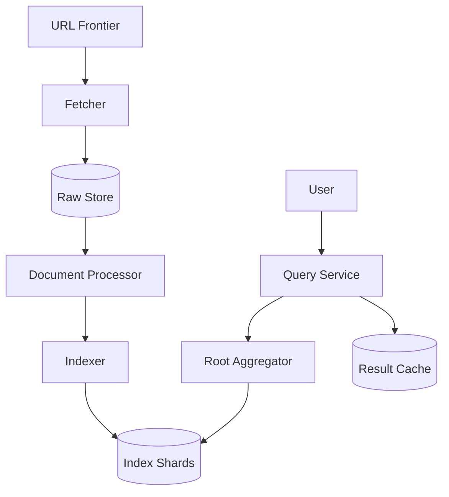

### Database Design / Index Structures

- **Inverted index:** term → list of `(docId, tf, positions)` compressed (FOR, roaring bitmaps).
- **Document store:** docId → title, URL, truncated body for snippets.
- **Link graph** (web): for PageRank-like signals.
- **Metadata DB:** crawl status, last_fetched, etag.
- **ACL index** (enterprise): docId → allowed principals; filter post-retrieve or term-expand principals.

Use Lucene/OpenSearch as pragmatic building block in interviews unless asked to invent postings format.

### API Design

```http
GET /v1/search?q=&page=&lang=&filter=
→ { "results":[ { "id","title","url","snippet","score" } ], "totalEstimate" }

GET /v1/suggest?q=
POST /v1/admin/takedown
POST /v1/indexes/{name}/documents  # enterprise push API
```

### Scaling Strategy

- Shard index by document ID; replicate shards for QPS.
- Tiered indexes: fresh realtime segment + large frozen segments (Lucene-style).
- Aggressive result caching for head queries; compute embeddings offline for semantic recall.
- Crawl politeness per domain; dedicated capacity for sitemaps.
- Separating complex ranking to second-phase on top-K candidates.

### Tradeoffs

| Choice | Benefit | Cost |
|--------|---------|------|
| Document sharding | Balanced storage | Cross-shard fanout queries |
| Term sharding | Good for rare terms | Harder ops |
| Boolean retrieval only | Simple | Poor relevance |
| Deep ML rankers | Quality | Latency/cost |
| Near-real-time index | Fresh | Less compression/efficiency |

### Bottlenecks

- Tail latency from slow shards (stragglers) — use hedging requests.
- Spam/junk flooding crawl budget.
- ACL filters exploding candidate sets in enterprise.
- GC/compaction on index segments.
- Snippet generation CPU.

### Security

- Takedowns and legal removals with audit.
- Safe search / malware landing page demotion.
- Enterprise: **document-level security**; never leak titles via suggest across ACL.
- Query injection into connectors; secrets not indexed.
- Rate-limit scrapers of your search API.

### Monitoring

- Query latency histograms per shard; error budgets.
- Index lag (time from publish to searchable).
- Crawl success rate; robots blocks.
- Zero-result rate; click metrics for quality (online evaluation).
- Memory/disk per shard; merge times.

### Improvements

- Hybrid lexical + vector search.
- Personalization with privacy constraints.
- Query rewriting and synonym graphs per domain.
- Continuous evaluation with human relevance judgments.
- Incremental deletion and tombstone compaction SLAs.

---

## 14. Design Inventory System

### Requirement Gathering

**Functional**

- Track stock across warehouses/stores; reserve on checkout; commit on payment; release on cancel.
- Transfers between warehouses; receiving ASNs; adjustments/cycle counts.
- Channel-aware ATP (available to promise) for web, retail, marketplace.
- Backorders/preorders policies optional.

**Non-functional**

- Prevent oversell under flash sales (correctness).
- High read ATP; bursty reserve/commit.
- Multi-warehouse routing (closest with stock).
- Auditability of every quantity change.

**Clarify**

- Single SKU warehouse or multi-location?
- Soft vs hard reservation?
- Omnichannel (BOPIS)?

**Back-of-envelope**

- 1M SKUs × 20 warehouses = 20M inventory rows.
- Flash sale: 5k reserves/sec on few hot SKUs — **hot key problem**.

### High Level Design

Inventory service owns quantities:

- `on_hand`, `reserved`, `available = on_hand - reserved` (simplified).
- Checkout calls `Reserve(sku, qty, locationPreference, ttl)`.
- Payment success → `Commit`; failure/expiry → `Release`.
- Use optimistic versioning or transactional updates; for extreme hot SKUs, **shard quantity tokens** or queue per SKU.

Emit events `StockReserved`, `StockDepleted` for storefront cache invalidation.

### Component Diagram

```
Storefront Cart → Reserve API → Inventory Service → Postgres/Spanner
                              ↓
                           Redis ATP cache (write-through careful)
Payment Webhook → Commit/Release
Warehouse WMS → Adjustments / Receipts
Kafka → Search/Storefront availability projections
```

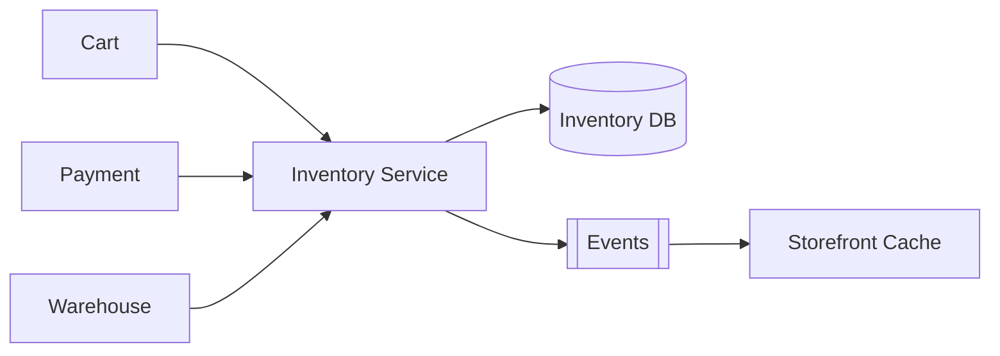

### Database Design

```text
inventory_levels(
  sku_id, warehouse_id,
  on_hand, reserved,
  version,
  PRIMARY KEY(sku_id, warehouse_id)
)

reservations(
  id, order_id, sku_id, warehouse_id,
  qty, status, expires_at, idempotency_key UNIQUE
)

inventory_ledger(
  id, sku_id, warehouse_id, delta, reason, ref_id, created_at
)
```

Optional: `sku_buckets(sku_id, bucket_id, qty)` to spread hot SKU contention.

### API Design

```http
POST /v1/reservations
Idempotency-Key: ...
{ "orderId", "lines":[ { "skuId", "qty" } ], "shipFrom": "AUTO" }

POST /v1/reservations/{id}/commit
POST /v1/reservations/{id}/release
POST /v1/adjustments  { "skuId","warehouseId","delta","reason" }
GET  /v1/atp?skuIds=...&region=
```

### Scaling Strategy

- Cache ATP with short TTL + event invalidation; never trust cache alone for reserve.
- Per-SKU serial queue (Kafka key=`skuId`) for extreme contention SKUs.
- Regional warehouses; reserve locally when possible.
- Read replicas for ATP dashboards; primary for mutations.
- Pre-split hot SKUs before big launches.

### Tradeoffs

| Choice | Benefit | Cost |
|--------|---------|------|
| Synchronous reserve in checkout | Less oversell | Higher checkout latency |
| Async stock check | Faster UX | Oversell risk |
| Single row per SKU-WH | Simple | Hot row |
| Token buckets | Parallel reserves | Complexity / fragmentation |
| Overbooking buffer | Absorb variance | Intentional oversell risk |

### Bottlenecks

- Hot SKU row locks during drops.
- Reservation expiry job storms.
- WMS adjustments conflicting with online reserves.
- Cache stampedes showing “in stock” falsely.
- Cross-warehouse partial reservations needing undo.

### Security

- Only trusted services can adjust inventory; mTLS + roles.
- Audit ledger immutable for shrinkage investigations.
- Prevent IDOR on reservations across tenants (multi-tenant commerce).
- Rate-limit reservation attempts to reduce scraping of stock levels.

### Monitoring

- Oversell count (target zero); reservation expire ratio; commit failures after reserve.
- Lock wait / version conflict rates per SKU.
- ATP accuracy vs physical cycle counts.
- Flash-sale dashboards: available qty timeseries.

### Improvements

- Omni ATP including in-store.
- Predictive inbound (ASN) selling.
- Package-level serial tracking for high value.
- Soft reservations in cart with progressive hard reserve.
- Multi-echelon optimization for replenishment.

---

## 15. Design Payment Gateway

### Requirement Gathering

**Functional**

- Accept payments: cards, wallet, bank transfer, BNPL — authorize, capture, void, refund.
- Merchant onboarding, API keys, webhooks, reconciliation files.
- 3DS / SCA challenges; stored credentials (tokenization).
- Multi-party splits / marketplace escrow optional.

**Non-functional**

- Idempotent financial operations; PCI DSS scope minimization.
- High availability authorize path; graceful degradation.
- Exactly-once money effects via ledger + provider reference uniqueness.
- Clear audit for chargebacks and disputes.

**Clarify**

- Processor vs full acquiring gateway?
- Which geographies/rails?
- Marketplace vs direct merchant?

**Back-of-envelope**

- 1k auth/sec peak; payload small; latency budget 1–2s including issuer.
- Webhooks outbound at similar order; retries with backoff.
- Settlement batch files nightly.

### High Level Design

Merchant → **Payment API** → **Orchestrator** chooses rail → **Connector** to acquirer/processor → normalize response → **Ledger** posts merchant/customer/suspense entries → return result → **Webhook** to merchant.

Tokenization vault holds PANs out of application scope; app stores only tokens. Use idempotency keys mapped to payment intents.

State machine: `REQUIRES_ACTION` (3DS) → `AUTHORIZED` → `CAPTURED` / `VOIDED`; `REFUNDED` partial/full.

### Component Diagram

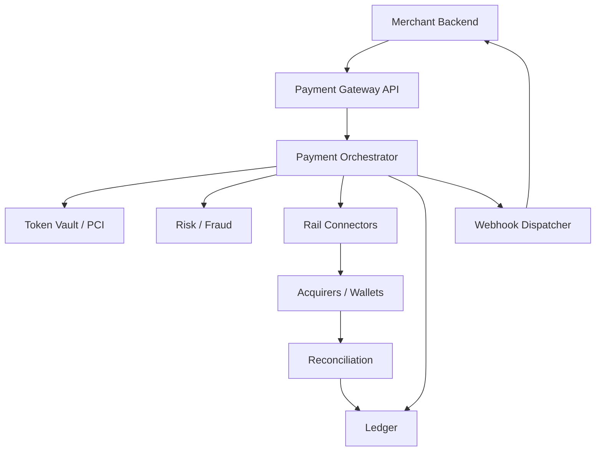

### Database Design

```text
merchants(id, status, webhook_url, keys_hash)
payment_intents(id, merchant_id, amount, currency, status, idempotency_key UNIQUE)
payment_attempts(id, intent_id, provider, provider_ref UNIQUE, status, raw_code)
ledger_entries(...)  -- double entry
refunds(...)
webhook_deliveries(id, event_id, attempt, status, next_retry_at)
payouts / settlements(...)
```

Never store raw PAN/CVV in this DB if using vault/hosted fields.

### API Design

```http
POST /v1/payment_intents
Idempotency-Key: ...
{ "amount": 2500, "currency": "USD", "captureMethod": "automatic",
  "paymentMethod": { "type": "card", "token": "tok_..." },
  "metadata": { "orderId": "..." } }

POST /v1/payment_intents/{id}/capture
POST /v1/payment_intents/{id}/refunds
GET  /v1/payment_intents/{id}

Webhook event: payment_intent.captured
HMAC header: X-Signature
```

### Scaling Strategy

- Stateless API tier; shard intents by `merchant_id` or intent id.
- Connector thread pools with bulkheads per acquirer.
- Outbox for webhooks; exponential retry with jitter; dead-letter after N.
- Regional deployments for data residency; route by merchant country.
- Read replicas for dashboards; primary for state transitions.

### Tradeoffs

| Choice | Benefit | Cost |
|--------|---------|------|
| Hosted payment page | Smaller PCI scope | Less UX control |
| Direct API + vault | Better UX | Broader security burden |
| Auto-capture | Simpler merchants | Harder fulfill-then-capture |
| Multi-acquirer smart routing | Higher auth rate | Complex ops |
| Sync response only | Simple | Misses async issuer outcomes |

### Bottlenecks

- Acquirer latency/outages — need failover routing.
- Hot merchant webhook endpoint slow → retry storms.
- Reconciliation mismatches on partial captures.
- Idempotency key misuse by merchants causing support load.
- 3DS dependent conversion drop.

### Security

- PCI DSS: network segmentation, vault, key management, no PAN in logs.
- HMAC webhook signatures + replay protection (timestamp).
- API keys/rotated secrets; mTLS for premium merchants.
- Fraud ML + rules; velocity limits; 3DS step-up.
- Strict TLS; certificate pinning optional for mobile SDKs.
- Employee access to dashboard audited; masking of PANs/tokens.

### Monitoring

- Auth rate by BIN/rail; soft decline vs hard decline taxonomy.
- p99 authorize latency; provider error budgets.
- Webhook success rate and age of oldest pending delivery.
- Reconciliation break count; settlement variance.
- Chargeback ratios by merchant (risk ops).

### Improvements

- Network tokens / account updater.
- Smart retry on soft declines with issuer rules.
- Real-time payouts.
- Unified dispute API.
- Idempotent client SDKs with automatic retries and clear state recovery.

---

## Cross-Cutting Cheatsheet for Lead Interviews

### Requirements script

1. Users & roles  
2. Core use cases (happy path)  
3. Scale numbers (QPS, storage, geo)  
4. Consistency / latency / availability priorities  
5. Compliance (PII, PCI, financial, data residency)  
6. Explicit non-goals  

### Numbers worth memorizing

| Measure | Rough value |
|---------|-------------|
| Seconds/day | 86,400 |
| Requests/sec from 1M events/day | ~12 RPS |
| 1 KB × 1k RPS | ~1 MB/s |
| 1 TB disk / machine | plan replication/erasure overhead |
| p99 vs p50 | design for tails, not averages |

### Java / Spring production patterns to name

- Idempotency keys + DB uniqueness  
- Transactional outbox + Kafka  
- Saga / process manager for multi-step bookings and payments  
- Resilience4j bulkheads/circuit breakers for supplier fan-out  
- `SELECT … FOR UPDATE` ordering for money/inventory  
- Structured logging with correlation IDs (`traceId`, `tripId`, `paymentId`)  

### Closing the interview

State assumptions, sketch the diagram, deep-dive the hardest constraint (consistency, fan-out, or hot keys), then cover failure modes, security, and how you would evolve the system in phases (MVP → scale → multi-region). That arc is what Lead panels reward.

---

## Notes

<!-- Add your own production stories: matching incidents, ledger bugs caught in review, CDN failovers, oversell postmortems, webhook retry storms. -->
